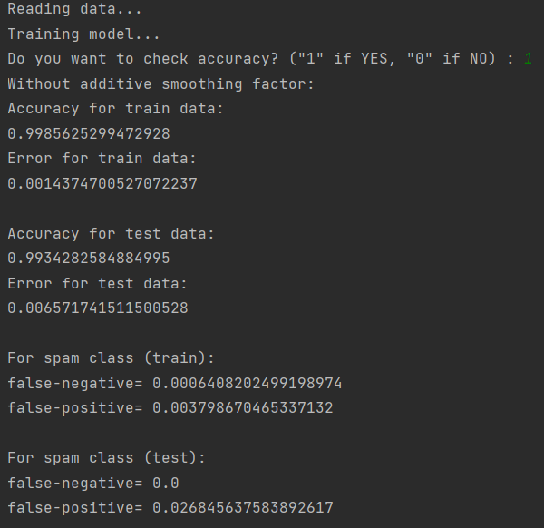
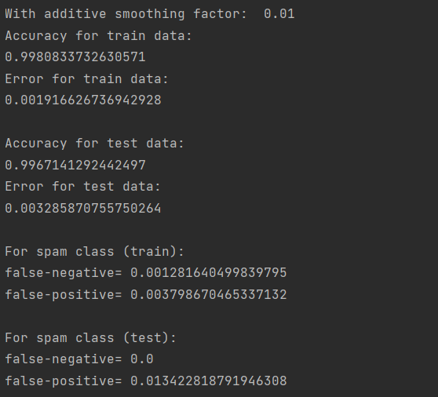
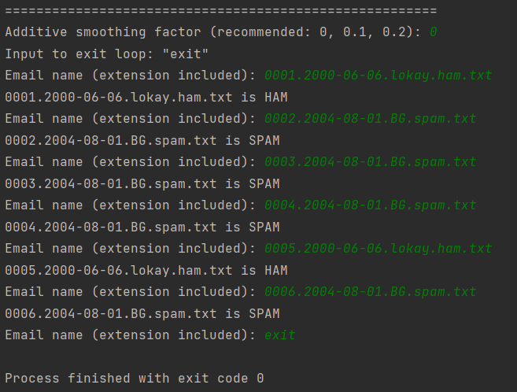

# Naive Bayes-based SPAM filter

The `Naive Bayes algorithm` is a probabilistic classifier that leverages Bayes' theorem to classify emails as either `spam` or `ham` (non-spam) based on their characteristics.

## Overview of the Code:

The code provides an implementation of a **Naive Bayes-based spam filter**. It aims to accurately classify incoming emails as either spam or ham by following these key steps:

* **Data Reading**: The code begins by reading in the training and testing data, which consists of a collection of labeled emails. This data serves as the basis for training and evaluating the spam filter.

* **Stop Words Removal**: To improve the effectiveness of the classification process, the code removes common stop words from the emails. These words, such as "the" or "and," are typically non-informative and do not contribute significantly to the spam classification.

* **Email Preprocessing**: The emails undergo preprocessing to prepare them for analysis. This includes converting the text to lowercase, removing punctuation and special characters, and splitting the content into individual words. This step ensures that the algorithm can focus on the relevant textual information for classification.

* **Parameter Estimation**: In this phase, the code estimates the necessary parameters for the Naive Bayes algorithm. It calculates the prior probabilities of spam and ham emails based on the training data. Additionally, dictionaries or frequency counts of words are built separately for the spam and ham categories. These dictionaries serve as the foundation for subsequent calculations.

* **Email Prediction**: The core of the code revolves around the prediction process. For each email, the Naive Bayes algorithm computes the likelihood of it belonging to the spam and ham classes. By applying Bayes' theorem, the code determines the posterior probabilities and makes a prediction based on the calculated values. If the probability of an email being spam is higher than that of it being ham, it is classified as spam.

* **Accuracy Evaluation**: To assess the performance of the spam filter, the code evaluates its accuracy by comparing the predicted labels with the actual labels from the testing data. This evaluation helps quantify the filter's ability to correctly classify emails. Metrics such as overall accuracy, false-positive rate, and false-negative rate are calculated, providing insights into its effectiveness.

The algorithm allows for the identification and prediction of individual email addresses. The user can input the email name, and the algorithm determines whether it is classified as spam or ham.

# Example
## Accuracy without additive smoothing factor

## Accuracy with additive smoothing factor

## Test

